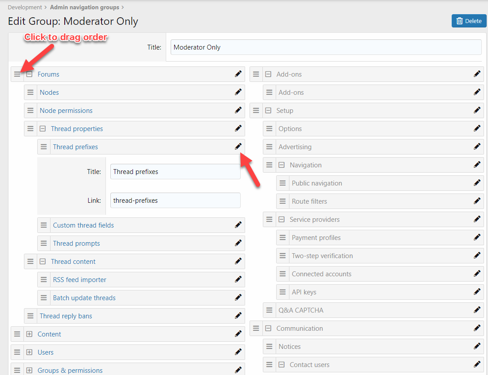
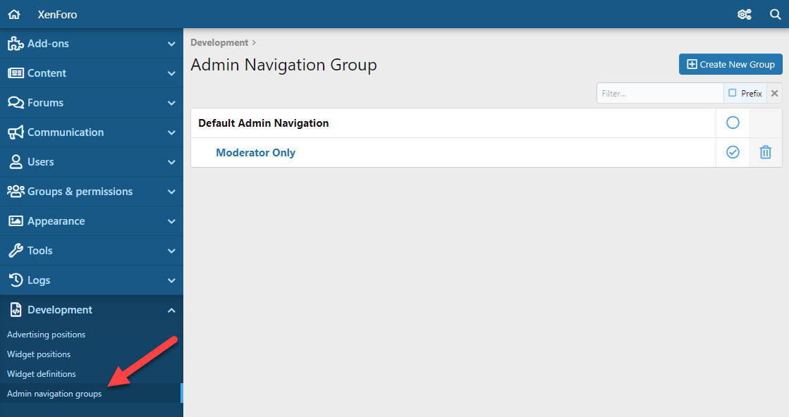

## [RD] Advanced Admin Navigation

Manage Admin Navigation with alot of features.

## Installation

- Upload the contents of the `upload` directory into the XenForo root directory
- Install and activate the add-on in your `Admin CP` -> `Add-ons`

## Features

- Manage multiple Admin Navigation Group
- Drag to order & nested menu
- Change title & link display in sidebar

## Screenshot

